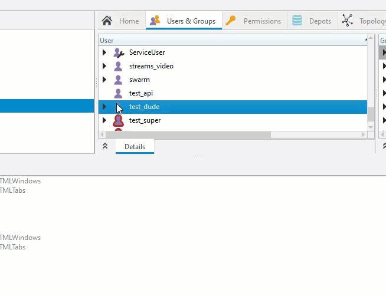
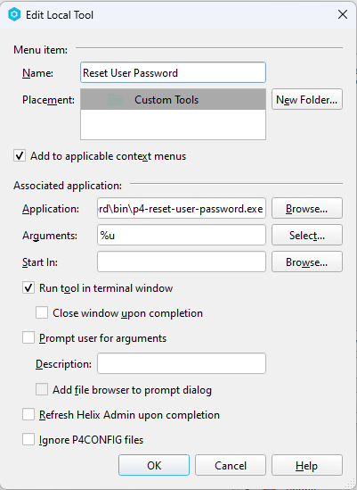
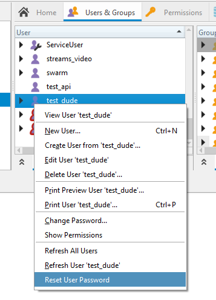
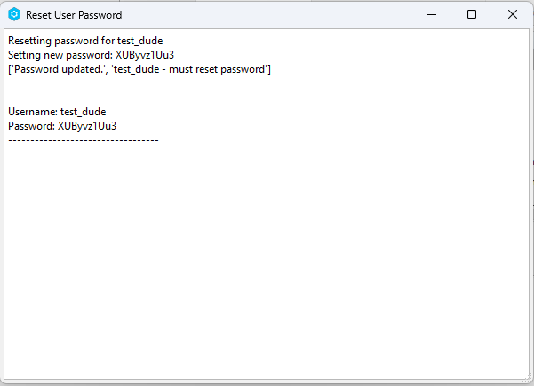

# p4-reset-user-password
Quick tool for admins to reset user passwords to a random temporary password and require the user to make a new password.

## Usage
Once installed as a custom tool in P4Admin, simply right-click on a user and select "Reset User Password".

The user will be given a new random password and will be required to change it upon next login. A terminal window will pop up with the new password for the admin to copy and paste to the user.

## Installation
1. Download the latest release from the [releases page](https://github.com/jase-perf/p4-reset-user-password/releases)
2. In P4Admin, go to **Tools -> Manage Tools -> Custom Tools...**
3. Click **New -> Tool...**
4. Name it `Reset User Password` (Or whatever you want)
5. Check the box for `Add to applicable context menus`
6. For **Application:** click Browse and select the downloaded executable
7. For **Arguments:** enter `%u` (Or click Select... and choose `Selected user`)
8. Check the box for `Run tool in terminal window`
9. Click **OK** to save the tool

To run it, right-click on a user in P4Admin and select `Reset User Password`. A terminal window will pop up with the new password for the admin to copy and paste to the user.

